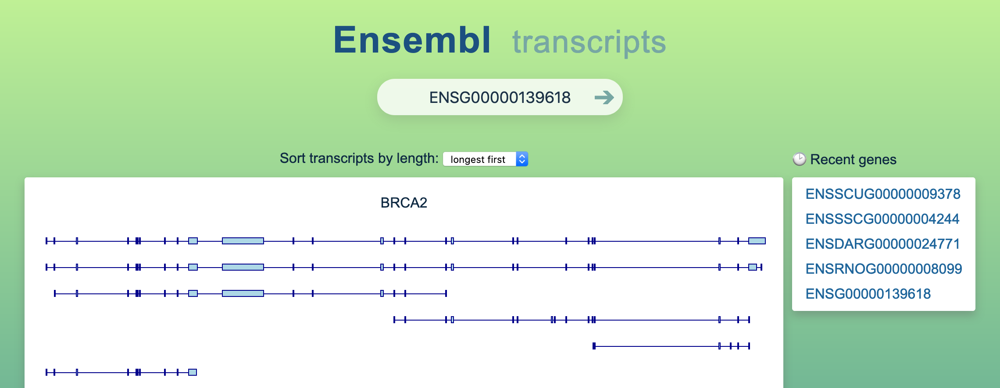

# Ensembl transcript browser

This is a prototype web application that draws gene transcripts using data from [Ensembl REST API](https://rest.ensembl.org).  

**[Demo site ⇢](https://veidenberg.github.io/ensembl-transcripts/)** 

## Run locally

1) Download this repo, go to its root folder, and launch a web server:
```sh
npm start #runs a python server: 'python -m SimpleHTTPServer 8000'
#or, for python 3: python3 -m http.server 8000
#or, use a node module: npm i -g http-server && http-server -a localhost -p 8000
```
2) Point your web browser to http://localhost:8000

**Serverless mode**  
The webapp can also be run offline:
1) Double-click `index.html` in the root folder
2) Load the example gene or use gene history (see [usage](#usage-tips))

## Usage tips

- Type a gene ID to the search bar and press Enter or click the arrow to render its transcripts
- Submitting empty input will load an example gene (also works in offline mode)
- Transcripts/canvas stretch to the window edges to maximize render area
- Hover interface elements, gene IDs or transcripts for help/metadata
- Blue transcripts are on forward strand / red on reverse strand

## Architecture

- Vue webapp, written in HTML, JavaScript and CSS
- Optimized for perfomrance, bundle size, ease of use and development
- Works out of the box, without bundlers or build pipelines
- Single dependency: Vue.js JavaScript library (for reactive UI)

### Compatibility

- Minimum: web browsers with [fetch support](https://caniuse.com/fetch) (from 2015 onwards)
- Recommended: web browsers with [grid support](https://caniuse.com/css-grid) (from 2017 onwards)

### Development

Use the Vue development version (see index.html) and a hot-reloading server.  
Example setup:
```sh
npm install -g live-server #install globally
live-server --port=8000 #also opens the webapp
```

### Testing

Webapp components are covered with unit tests (located in `__tests__` folder).
1) Run `npm install` in the webapp root folder to install the testing tools.
  - Uses [Jest](https://jestjs.io) and [Vue Testing Library](https://github.com/testing-library/vue-testing-library)
  - Tests are run without a build step (no need for Babel, WebPack, etc.)
2) Run `jest` (or `npm run test:unit`) to launch the test suite.

# License

[MIT](https://opensource.org/licenses/MIT)  
Author: [Andres Veidenberg](https://www.linkedin.com/in/aveidenberg/)